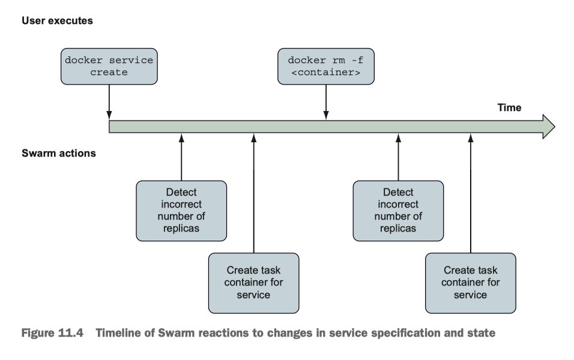

# A service

Defination of a service:

> any processes, functionality, or data that must be discoverable and **available** over a network.


The difficulty of running a service is, by definition, more about managing **availability** of something on a network.

So service definition is predominantly about:

 - how to run replicas,
 - manage changes to the software,
 - and route requests to the service endpoint to that software.

These are the higher-level properties uniquely associated with the service abstraction.


## Docker swarm


Lets enables the service abstraction:

```
$  docker swarm init
Swarm initialized: current node (yyyyyyyyyyyyyyyyyyyyy) is now a manager.

To add a worker to this swarm, run the following command:

    docker swarm join --token xxxxxxxxxxxxxxxxxxxxxxxxx 192.168.65.3:2377

To add a manager to this swarm, run 'docker swarm join-token manager' and follow the instructions.

```

Starts the server on localhost:8080

```
docker service create \
  --publish 8080:80 \
  --name hello-world \
  dockerinaction/ch11_service_hw:v1
3do8qcbwel21sbq3essibe3il
overall progress: 1 out of 1 tasks
1/1: running   [==================================================>]
verify: Service converged
```

You see in above progress bar describing the state of the service.
Once the progress is complete, it will be labeled `Running`.

A get request to `localhost:8080` return a message along with task ID.

```
$ curl -i localhost:8080
HTTP/1.1 200 OK
Date: Tue, 09 Nov 2021 04:39:27 GMT
Content-Length: 45
Content-Type: text/plain; charset=utf-8

Hello, World! --ServiceV1, Task: 8c432a101004~/Desktop
```

Docker services are available only when Docker is running in swarm mode.

## 11.01.01-01 Automated resurrection

### Task

A task is a swarm concept that represents a unit of work. Each task has one associated container.
For our purposes, you can consider the terms task and container roughly interchangeable.

```
$ docker service ls
ID             NAME          MODE         REPLICAS   IMAGE                               PORTS
3do8qcbwel21   hello-world   replicated   1/1        dockerinaction/ch11_service_hw:v1   *:8080->80/tcp
```

```
$ docker service ps 3do8qcbwel21
ID             NAME            IMAGE                               NODE             DESIRED STATE   CURRENT STATE           ERROR     PORTS
3csedbwgc9no   hello-world.1   dockerinaction/ch11_service_hw:v1   docker-desktop   Running         Running 8 minutes ago
```

```
$ docker ps
CONTAINER ID   IMAGE                               COMMAND          CREATED          STATUS                    PORTS     NAMES
8c432a101004   dockerinaction/ch11_service_hw:v1   "/bin/service"   17 minutes ago   Up 17 minutes (healthy)             hello-world.1.3csedbwgc9nom86ltbwgj0q3f
```

How is services and containers differ?

If you remove the sole container that is powering the `hello-world`
 service,  the container will be stopped and removed, but after a few moments it will be back.

```
$ docker container rm 8c432a101004 -f
8c432a101004
```

Run run `ps` immediate you will notice `STATUS` is ` Up Less than a second (health: starting)`

```
$ docker ps
CONTAINER ID   IMAGE                               COMMAND          CREATED         STATUS                                     PORTS     NAMES
dc0b02a58f55   dockerinaction/ch11_service_hw:v1   "/bin/service"   5 seconds ago   Up Less than a second (health: starting)             hello-world.1.5cynni6suobpfcjje739nifbt
```
Run `ps` again,  the `STATUS` is `Up 40 seconds (healthy)`

```
$ docker ps
CONTAINER ID   IMAGE                               COMMAND          CREATED          STATUS                    PORTS     NAMES
dc0b02a58f55   dockerinaction/ch11_service_hw:v1   "/bin/service"   46 seconds ago   Up 40 seconds (healthy)             hello-world.1.5cynni6suobpfcjje739nifbt
```

```
$ docker service ls
ID             NAME          MODE         REPLICAS   IMAGE                               PORTS
3do8qcbwel21   hello-world   replicated   1/1        dockerinaction/ch11_service_hw:v1   *:8080->80/tcp
```

```
$ docker service ps hello-world
ID             NAME                IMAGE                               NODE             DESIRED STATE   CURRENT STATE           ERROR                         PORTS
5cynni6suobp   hello-world.1       dockerinaction/ch11_service_hw:v1   docker-desktop   Running         Running 5 minutes ago
3csedbwgc9no    \_ hello-world.1   dockerinaction/ch11_service_hw:v1   docker-desktop   Shutdown        Failed 5 minutes ago    "task: non-zero exit (137)"
```

Note in above The list will show the first entry with a `DESIRED STATE` of `Running`, and a `CURRENT STATE` of `Running x minutes ago`.
The second entry will be listed as `Shutdown` and `Failed` respectively:

Here is the excerpt from docker service ps output:

```
NAME                  DESIRED STATE   CURRENT STATE           ERROR
hello-world.1         Running         Running 5 minutes ago
 \_ hello-world.1     Shutdown        Failed 5 minutes ago    "task: non-zero exit (137)"
```

Swarm components in Docker is an Autonomous orchestrators. It tracks two things:

- desired state (what it is supposed to be doing)
- current state (what the system is actually doing)

Orchestrators track these two descriptions of state and reconcile the two by changing the system.

Orchestrator knows is that the process has failed and that the
 desired state of the service is Running. Swarm knows how to make
 a process run: start a container for that service:



Orchestrators remember how a system should be operating and manipulate
 it without being asked to do so by a user. So, in order to use
 orchestrators effectively, you need to understand how to describe
 systems and their operation.

When you run:

```
docker service inspect hello-worlddocker
```

Docker will output the current desired state definition for the service.

(see file: `hello-world-inspect.json`)

The resulting JSON document includes the following:

 - Name of the service
 - Service ID
 - Versioning and timestamps
 - A template for the container workloads
 - A replication mode
 - Rollout parameters
 - Similar rollback parameters
 - A description of the service endpoint


---

## 11.01.01-02 replication


### Relipction mode = Replicated:

Lets look at the `Mode` field of the output from `docker service inspect`.
`Mode` tells Swarm how to run replicas of the workload. It can have value `Global` or `Replicated`:

```
 "Mode": {
      "Replicated": {
          "Replicas": 1
      }
  },
```

When the value is `Replicated` (default) The service will create and maintain a fixed number of replicas.
Lets experiement by change the number replicas with the `docker service scale` command:

```
$ docker service scale hello-world=3
hello-world scaled to 3
overall progress: 3 out of 3 tasks
1/3: running   [==================================================>]
2/3: running   [==================================================>]
3/3: running   [==================================================>]
verify: Service converged
```

Now there should be 3 containers running:

```
$ docker container ps -a
CONTAINER ID   IMAGE                               COMMAND          CREATED             STATUS                       PORTS     NAMES
83cc359ead70   dockerinaction/ch11_service_hw:v1   "/bin/service"   19 minutes ago      Up 19 minutes (healthy)                hello-world.2.ji3hg3g7kbu9ha8nvbjtnr29n
7a2961e756dd   dockerinaction/ch11_service_hw:v1   "/bin/service"   19 minutes ago      Up 19 minutes (healthy)                hello-world.3.zhlw8ft8tc0lqp271hwsd3z40
dc0b02a58f55   dockerinaction/ch11_service_hw:v1   "/bin/service"   About an hour ago   Up About an hour (healthy)             hello-world.1.5cynni6suobpfcjje739nifbt
```

Or

```
$ docker service ps hello-world
ID             NAME                IMAGE                               NODE             DESIRED STATE   CURRENT STATE               ERROR                         PORTS
5cynni6suobp   hello-world.1       dockerinaction/ch11_service_hw:v1   docker-desktop   Running         Running about an hour ago
3csedbwgc9no    \_ hello-world.1   dockerinaction/ch11_service_hw:v1   docker-desktop   Shutdown        Failed about an hour ago    "task: non-zero exit (137)"
ji3hg3g7kbu9   hello-world.2       dockerinaction/ch11_service_hw:v1   docker-desktop   Running         Running 18 minutes ago
zhlw8ft8tc0l   hello-world.3       dockerinaction/ch11_service_hw:v1   docker-desktop   Running         Running 18 minutes ago
```

Notice the name convention:

```
NAMES
hello-world.2
hello-world.3
hello-world.1
```

### Relipction mode = Global:

`Global` tells Docker to run one replica on each node in the swarm cluster.
Services in global mode are useful for maintaining a common set
 of infrastructure services that must be available locally on
 each node in a cluster.


