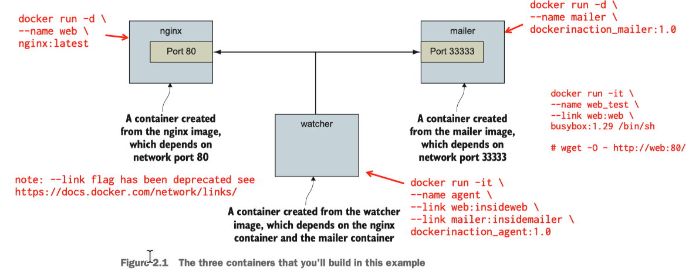

## ## 2.1.0 -- 2.1.3



---
⚠️ The `--link` flag has been deprecated. <br>
See [https://docs.docker.com/network/links/](https://docs.docker.com/network/links/)

---
section 2.1.1 (page 21) <br>
label: nginx <br>
container-name: web <br> 
image-name: nginx:latest <br>


```
docker run -d \
--name web \
nginx:latest
```
---
section 2.1.1 (page 22) <br>
label: watcher <br>
container-name: mailer <br> 
image-name: dockerinaction_mailer:1.0 <br>

```
cd wf--docker-in-action-2ed/chaps/02/02_mailer

docker build -t dockerinaction_mailer:1.0 .

docker run -d \
--name mailer \
dockerinaction_mailer:1.0
```
---

section 2.1.2 (page 22-23) <br>
label: no label (for test purpose)<br>
container-name: web_test <br> 
image-name: busybox:1.29 <br>

```
docker run -it \
--name web_test \
--link web \
busybox:1.29 /bin/sh

# wget -O - http://web:80/
Connecting to web:80 (172.17.0.2:80)
<!DOCTYPE html>
<html>
<head>
...
</head>
<body>
<h1>Welcome to nginx!</h1>
<p>If you see this page, the nginx web server is successfully installed and
working. Further configuration is required.</p>
...

#^pq
```
---
section 2.1.2 (page 23) <br>
label: watcher <br>
container-name: mailer <br> 
image-name: dockerinaction_mailer:1.0 <br>

```
cd wf--docker-in-action-2ed/chaps/02/02_agent

docker build -t dockerinaction_agent:1.0 .

docker run -it \
--name agent \
--link web:insideweb \
--link mailer:insidemailer \
dockerinaction_agent:1.0 

System up.
System up.
System up.
System up.
...
...
^c
```


Summary of images created:

```
% docker images
REPOSITORY                    TAG       IMAGE ID       CREATED          SIZE
dockerinaction_agent          1.0       ff354fa69684   29 minutes ago   1.24MB
dockerinaction_mailer         1.0       8448fd483424   2 months ago     1.24MB
nginx                         latest    08b152afcfae   2 months ago     133MB
```

Summary running container:

```
% docker ps
CONTAINER ID   IMAGE                       COMMAND                  PORTS       NAMES
5a85bc0e101b   dockerinaction_agent:1.0    "/watcher/watcher.sh"                agent
74bbd4fd2957   dockerinaction_mailer:1.0   "/mailer/mailer.sh"      33333/tcp   mailer
a5ae14fd9a95   nginx:latest                "/docker-entrypoint.…"   80/tcp      web
```

```
docker stop $(docker ps -q)
```
---
section 2.1.3 (page 24) <br>

```
docker restart web 
docker restart mailer 
docker restart agent
```

```
% docker logs web
....
....
172.17.0.4 - - [30/Sep/2021:17:03:06 +0000] "GET / HTTP/1.0" 200 612 "-" "-" "-"
....
....
```

```
% docker logs mailer
CH2 Example Mailer has started.
CH2 Example Mailer has started.
```

```
% docker logs agent
System up.
System up.
....
....
```
---

