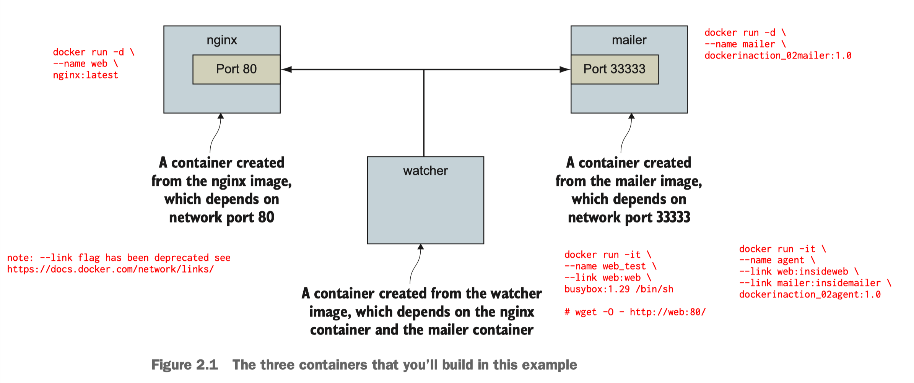

## ## 2.1.0 -- 2.1.2



---

nginx: 2.1.1 (page 21)

```
docker run -d \
--name web \
nginx:latest
```

mailer: 2.1.1 (page 22)

```
cd wf--docker-in-action-2ed/chaps/02/02_mailer

docker build -t dockerinaction_mailer:1.0 .

docker run -d \
--name mailer \
dockerinaction_mailer:1.0
```


watcher (check): 2.1.2 (page 22-23)

```
docker build -t dockerinaction_02agent:1.0 .

docker run -it \
--name web_test \
--link web \           # <--- [1]
busybox:1.29 /bin/sh

# wget -O - http://web:80/
Connecting to web:80 (172.17.0.2:80)
<!DOCTYPE html>
<html>
<head>
...
</head>
<body>
<h1>Welcome to nginx!</h1>
<p>If you see this page, the nginx web server is successfully installed and
working. Further configuration is required.</p>
...

#^pq
```

watcher:2.1.2 (page 23)

```
cd wf--docker-in-action-2ed/chaps/02/02_agent

docker build -t dockerinaction_02agent:1.0 .

docker run -it \
--name agent \
--link web:insideweb \   # <--- [1]
--link mailer:insidemailer \
dockerinaction_02agent:1.0 

System up.
System up.
System up.
System up.
...
...
^c
```

```
docker stop $(docker ps -aq)
```
---
Ref: <br>
[1] <br>
⚠️ The `--link` flag has been deprecated. See [https://docs.docker.com/network/links/](https://docs.docker.com/network/links/)